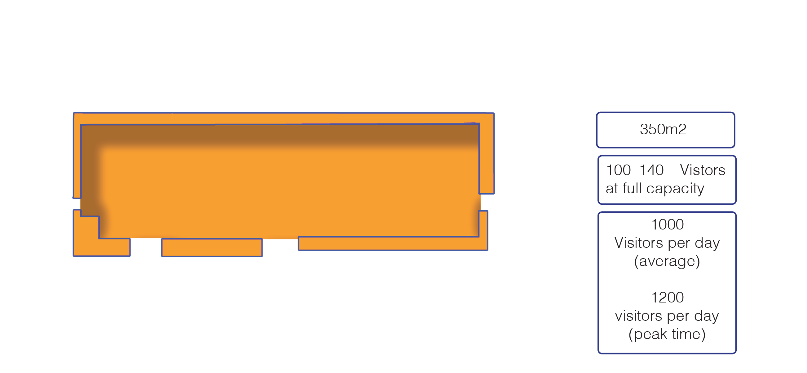
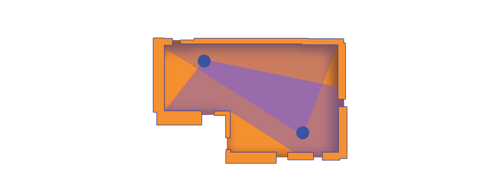
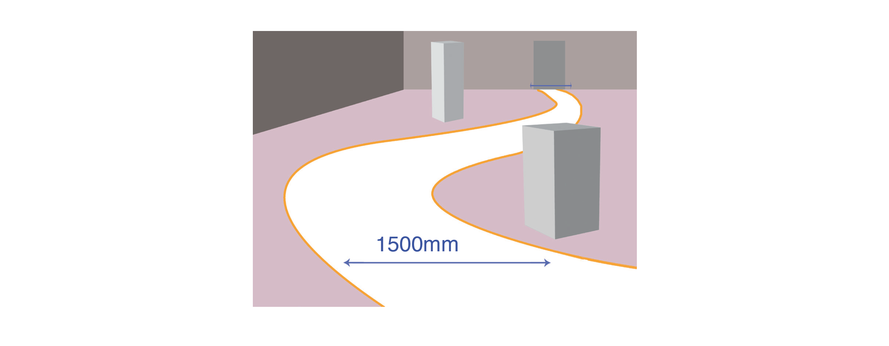

# Visitor flow and circulation

## Gallery 1

Gallery 1 is our biggest gallery, located on the ground floor of the museum. When full capacity has been reached, visitors are asked to queue in the ground floor atrium. 

## Gallery 2

Gallery 2 is located on 1st floor. When full capacity has been reached, visitors are asked to queue in the east lobby area, adjacent to the Medicine Man entrance.

## Entrance and exit

As the first point of contact with the exhibition, the entrance should be welcoming, clearly visible and well signed. This can be done by contrasting it with the surrounding structure. Exits similarly need to be easy to identify and spot from inside the exhibition space. Entrance doors should be 1500mm wide.

Level access should be maintained at all entrances and exits, with a clear approach and good circulation space either side of the doors \(minimum of 1500mm2 at each door\). 

## Staff

Gallery spaces are typically staffed by 2 Visitor Experience Assistants, who will need good sight lines around the space for invigilation.

## Tours

We run regular exhibition tours for people with sight loss \(audio described and sensory tours\) and hearing loss \(BSL and Speech to Text\), as well as spoken perspective tours for larger groups.

## Circulation

Our standard circulation route width is 1500 mm. Circulation routes should be clearly defined, well-lit and easy to follow. If blackout or low-lit spaces are needed for an installation, designers should ensure that there is floor lighting/high-contrast marking or a high-contrast hand rail to guide visitors. Any transparent partitions should be clearly marked with high-contrast manifestations.

## Trip hazards

Designers should ensure that there are no trip hazards. Objects mounted on the floor at low height levels should be highlighted \(i.e. high-contrast\) and out of the general circulation paths. Low-level plinths should be highlighted. Low-level barriers are difficult to detect in a crowded exhibition. If they are required by an object lender or conservator, they must be carefully placed to avoid causing a trip hazard.

## Floor surfaces

Floor surfaces must be slip-resistant, stable and even. Carpet must be secured and have a low-level pile with no thick pad underneath. Transitions between floor surfaces should be flat \(i.e. taped or chamfered\)

## Stairs, lifts, and ramps

Changing levels are generally problematic for wheelchair users, therefore we discourage changes of level within exhibitions. Get more specific information about ramps [here](https://company-57536.frontify.com/r/uN1BSu1Kog7p1TF_sbqh0CPLOiRRT9A8JzuUZfBpl4Y,).  

